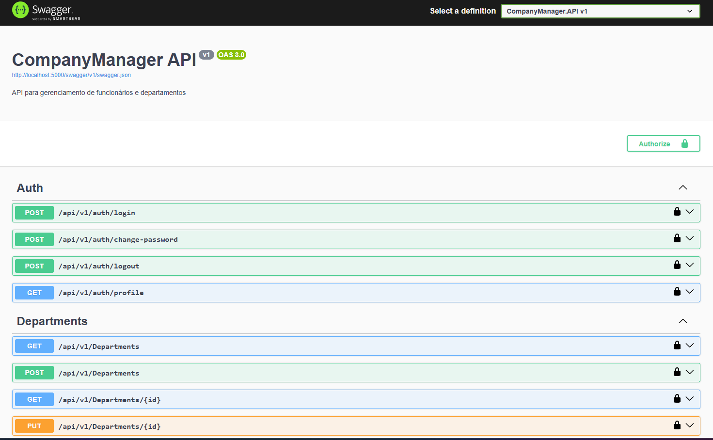

# Company Manager API

This project provides a RESTful API built with ASP.NET Core (.NET 8), using SQL Server and Docker for backend infrastructure. It implements authentication via JWT and follows a clean architecture with DDD principles for complete company, department, employee, and job title management.

---

## 🛠️ Setup

Before running, ensure the project builds correctly:

```bash
dotnet clean
dotnet build
```

Then run the full environment with Docker:

```bash
docker-compose up --build
```

The API will be available at:

```
http://localhost:5000/swagger
```

The Frontend will be available at:

```
http://localhost:3000
```

---

## 👤 Creating a User

Use the following cURL command to create your first user:

```bash
curl -X 'POST' \
  'http://localhost:5000/api/Auth/register' \
  -H 'accept: text/plain' \
  -H 'Content-Type: application/json' \
  -d '{
  "username": "Admin",
  "password": "Admin@123456",
  "email": "admin@company.com",
  "role": "SuperUser"
}'
```

---

## 🔐 Authentication

After creating the user, obtain a JWT token via:

```bash
curl -X 'POST' \
  'http://localhost:5000/api/Auth/authenticate' \
  -H 'accept: text/plain' \
  -H 'Content-Type: application/json' \
  -d '{
  "email": "admin@company.com",
  "password": "Admin@123456"
}'
```

### ✅ Response Example

```json
{
  "data": {
    "token": "eyJhbGciOiJIUzI1NiIsInR5cCI6IkpXVCJ9...",
    "email": "admin@company.com",
    "username": "Admin",
    "role": "SuperUser"
  },
  "success": true,
  "message": "User authenticated successfully",
  "errors": []
}
```

---

## 🔓 Using the Token

After authenticating, you can call protected endpoints. In Swagger, use **"Authorize"** at the top and insert:

```
Bearer <your_token>
```

Or via cURL, access protected resources:

```bash
curl -X 'GET' \
  'http://localhost:5000/api/Departments' \
  -H 'accept: text/plain' \
  -H 'Authorization: Bearer <your_token>'
```

---

## 📊 Main Features

### 🏢 Department Management
- Create, edit, list and delete departments
- Organizational hierarchy
- Filters and pagination

### 👥 Employee Management
- Complete employee registration
- Association with departments and job titles
- Organizational hierarchy validation
- Role-based access control

### 💼 Job Title Management
- Definition of job titles and responsibilities
- Salary structure
- Hierarchical levels

### 🔐 Access Control
- JWT Authentication
- Hierarchical authorization
- Role and permission management

---

## 🏗️ Architecture

### Backend (.NET 8)
- **Framework:** ASP.NET Core 8
- **Database:** SQL Server 2022
- **ORM:** Entity Framework Core 8
- **Authentication:** JWT Bearer Tokens
- **Architecture:** Clean Architecture + DDD
- **Patterns:** CQRS with MediatR
- **Validation:** FluentValidation
- **Mapping:** AutoMapper
- **Testing:** xUnit

### Frontend (React)
- **Framework:** React 18
- **Language:** TypeScript
- **Build Tool:** Vite
- **Styling:** Tailwind CSS
- **Routing:** React Router DOM
- **HTTP Client:** Axios
- **Icons:** Heroicons
- **Notifications:** React Hot Toast


---

## 📦 Tech Stack

### Backend
- ASP.NET Core 8
- SQL Server 2022
- Entity Framework Core 8
- Docker
- MediatR (CQRS)
- AutoMapper
- FluentValidation
- JWT Authentication
- DDD + Clean Architecture

### Frontend
- React 18
- TypeScript
- Vite
- Tailwind CSS
- React Router DOM
- Axios
- Heroicons
- React Hot Toast

---

## 🧪 Usage Tips

- Always create a user before authenticating
- Use Swagger to explore all endpoints visually
- JWT is required for most protected endpoints
- Organizational hierarchy is automatically respected
- Employees can only manage direct subordinates
- Frontend runs on port 3000, API on port 5000
- Database management available via Adminer on port 8080

---

## 📸 Evidence

Below are screenshots confirming complete execution and validation of the system:

### ✅ 1. Docker Compose Running


### ➕ 2. Create User


### 📥 3. Validate Token


### 🧪 4. Add Bearer Token to Swagger Authorize


### 📦 5. Get Departments with Token


### 🔄 6. Swagger Interface Active


### ✅ 7. Unit Tests Successful


---

## 🖥️ Frontend Interface

### 🔐 8. Login Screen


### 🏠 9. Main Dashboard


### 👤 10. User Creation via Frontend


### 🏢 11. Department Listing


### ➕ 12. Department Creation


### ✏️ 13. Department Editing


### 👥 14. Employee Listing


### ➕ 15. Employee Creation


### ✏️ 16. Employee Editing


---

